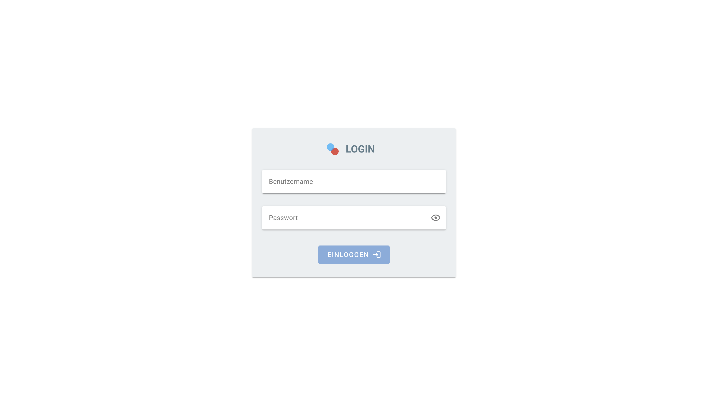

# Kantinenmanager (group-16)



## 📋 Requirements

Make sure you have the following installed:

- [NodeJS](https://nodejs.org) (Recommendation: use [NVM](https://github.com/nvm-sh/nvm) for Linux/Mac or [NVM-Windows](https://github.com/coreybutler/nvm-windows) for Windows to manage multiple versions of NodeJS)
- [Docker Desktop](https://www.docker.com/products/docker-desktop/)
- [VS Code](https://code.visualstudio.com/)

If you open this project in VS Code you should get a list of recommended extensions.

## 🚀 Getting started

### 📝 Create .env file

Project configuration is done via a `.env` file. To create `.env` files with default values, run `python scripts/init.py` or `python3 scripts/init.py` from the project root. Alternatively, you can run `docker compose run init` to start a Python container and execute the script automatically.

Once the configuration is complete, you can choose one of the following methods to start the project.

### 🐳 Using Dev Containers (Recommended)

Dev Containers allow you to connect VS Code directly to a Docker container, enabling you to develop inside the container using autocompletion as well as npm and python commands just like on your local machine.

**First Start:**

1. Install the VS Code `Dev Containers` extension by Microsoft, if not already installed.
2. Open the root of this project in VS Code.
3. Open the VS Code command palette: Mac ⇧⌘P, Windows Ctrl+Shift+P.
4. Run `Dev Containers: Rebuild and Reopen in Container`.
5. Choose one of the following options:
   - `Frontend All` - Starts all containers and connects to the frontend container.
   - `Backend All` - Starts all containers and connects to the backend container.
6. Wait for the containers to build and start. The initial load may take some time as it builds all the images (monitor progress by clicking the loading bar in the bottom right).

**Important:** Containers may continue running after closing VS Code. Stop them manually using Docker Desktop or the CLI.

**Shutting Down:**

1. Close VS Code or click the blue button in the bottom left, then select `Close Remote Connection`.
2. Stop the containers using Docker Desktop or the CLI as described in a later section.

**Troubleshooting:**

- If issues arise, try running `Dev Containers: Rebuild Container`.
- If the Flask or Node app isn't running in the terminal, disconnect and restart the container (the npm/flask command runs only when the container starts but continues after disconnection).

In the native VS Code terminal you are able to run Python and npm commands.

**Start the backend from within the backend container:**

```bash
cd backend # change directory from /app to /app/backend
flask --app startup:app run --host=0.0.0.0 --port=4200 --debug # run the app
```

**Start debugging the backend:**

1. Make sure you are connected to the backend container
2. Stop the flask process in the default terminal (press CTRL+C)
3. Go to the "Run and Debug" tab on the left in VS Code
4. Select "Python: Dev Container" at the top
5. Click the little green play button at the top left

### 🐋 Using Docker Compose in VS Code UI

If you have opened this project in VS Code and installed all recommended extensions, you can start the project by following these steps:

1. Go to the Explorer tab in VS Code.
2. Open the Task Explorer submenu at the bottom.
3. Navigate to `group-16 > vscode`.

Here are the available tasks:

- **Start Dev**: Start the application in development mode.
- **Start Debug**: Start the application in debug mode.
- **Open Frontend**: Open the frontend in your browser.
- **Open Swagger**: Open the backend API documentation in your browser.

Alternatively, you can use the "Tasks: Run Task" command in VS Code to run these tasks. The "Start Dev" task should also appear in the status bar at the bottom of the screen.

### 🛠️ Manually run Docker Compose commands

You can also manually run Docker commands from the root of the project:

```shell
docker compose up --build # Start the application in development mode
docker compose up --build -d # Start the application in development mode in background
docker compose stop # Stop all containers of this project
docker compose down # Stop and remove containers

docker compose -f docker-compose.debug.yml up --build # Start the application in debug mode
```

**Hint:** Debug mode uses a Python Debugger, allowing you to use the "Run and Debug" tab of VS Code. Select "Python: Remote Attach" and click the small green play button in the top left. This will disable hot-reloading.

**Hint:** The default backend port is `4200` and the frontend uses `3000`.

## 🙈 Grafana

Access Grafana on `http://<server-ip>:30433`.

## 🧪 Running Tests

### Backend

To run tests using Dev Containers connected to the backend container, open a new terminal in VS Code (top bar -> Terminal -> New Terminal). Then, execute one of the following commands:

```bash
FLASK_ENV=testing pytest backend/  # Run all tests once and then exit

FLASK_ENV=testing pytest --cov=backend backend/  # Run all tests once and generate a coverage report

FLASK_ENV=testing ptw backend/  # Start a test runner that will watch for file changes and automatically rerun tests
```

To only run End-to-End tests or unit tests use `backend/e2e` or `backend/tests` respectively.

You can start a separate Docker container to run the tests:

```bash
docker compose run test-backend  # Run tests and then exit

docker compose run test-backend-watch  # Start a test runner that will watch for file changes and automatically rerun tests
```

### Frontend

#todo

## 🗄️ Database Migrations

All database migrations are checked in with Git. They are applied automatically when starting the backend container.

After changing SQLAlchemy models it is necessary to generate a new migration script to apply those changes.

```bash
# Generate a new migration
# In the backend container (or locally with all Python dependencies installed) run the following commands:
cd backend # change directory
FLASK_ENV=migration alembic revision --autogenerate -m "<YOUR_MESSAGE>"

# Apply pending revisions
cd backend
FLASK_ENV=migration alembic upgrade head
# Alternatively, restart the backend container

# Downgrade revisions
FLASK_ENV=migration alembic downgrade -1

# Get information
FLASK_ENV=migration alembic current
```

[Alembic Documentation](https://alembic.sqlalchemy.org/en/latest/tutorial.html)

## 🙏 Authors

- Amelie Biwolé
- Lalita Kuhn
- Moritz Oczko
- Hazem Rikabi
- Nico Schroeder
- Lennox Schuster
- Sidney Stiller
